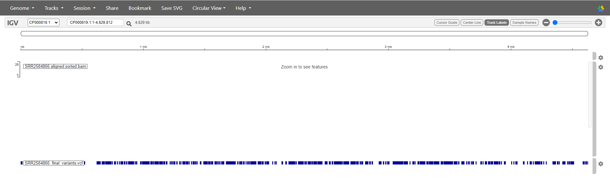

We mentioned before that we are working with files from a long-term evolution study of an *E. coli* population (designated Ara-3). Now that we have looked at our data to make sure that it is high quality, and removed low-quality base calls, we can perform variant calling to see how the population changed over time. We care how this population changed relative to the original population, *E. coli* strain REL606. Therefore, we will align each of our samples to the *E. coli* REL606 reference genome, and see what differences exist in our reads versus the genome.

# Alignment to a reference genome

We perform read alignment or mapping to determine where in the genome our reads originated from. There are a number of tools to
choose from and, while there is no gold standard, there are some tools that are better suited for particular NGS analyses. We will be
using the [Burrows Wheeler Aligner (BWA)](http://bio-bwa.sourceforge.net/), which is a software package for mapping low-divergent
sequences against a large reference genome.

The alignment process consists of two steps:

1. Indexing the reference genome
2. Aligning the reads to the reference genome

# Setting up

First we download the reference genome for *E. coli* REL606. Although we could copy or move the file with `cp` or `mv`, most genomics workflows begin with a download step, so we will practice that here.

~~~
$ cd ~/cs_course
$ curl -L -o data/ecoli_rel606.fasta.gz ftp://ftp.ncbi.nlm.nih.gov/genomes/all/GCA/000/017/985/GCA_000017985.1_ASM1798v1/GCA_000017985.1_ASM1798v1_genomic.fna.gz
~~~
{: .bash}

The `-L` flag stands for location. If the server reports that the requested page has moved then `curl` will redo the request on the new page. The `-o` flag means the output goes to a file rather than the terminal.

The file `ecoli_rel606.fasta.gz` has been dowloaded to the `data` folder since we specified `data/ecoli_rel606.fasta.gz` in the `curl` command. This file needs to be decompressed (unzipped) with:

~~~
$ gunzip data/ecoli_rel606.fasta.gz
~~~
{: .bash}

> ## Exercise
>
> We saved this file as `data/ecoli_rel606.fasta.gz` and then decompressed it.
> What is the real name of the genome?
>
> Hint: the name of the genome is often recorded at the top of the file.
>
>> ## Solution
>>
>> ~~~
>> $ head data/ecoli_rel606.fasta
>> ~~~
>> {: .bash}
>>
>> The name of the sequence follows the `>` character. The name is `CP000819.1 Escherichia coli B str. REL606, complete genome`.
>> Keep this chromosome name (`CP000819.1`) in mind, as we will use it later in the lesson.
> {: .solution}
{: .challenge}

We will also download a set of trimmed FASTQ files to work with. These are small subsets of our real trimmed data,
and will enable us to run our variant calling workflow quite quickly.

~~~
$ curl -L -o sub.tar.gz https://ndownloader.figshare.com/files/14418248
~~~
{: .bash}

The `sub.tar.gz` file also needs to be decompressed.

~~~
$ tar xvf sub.tar.gz
~~~
{: .bash}

You now have a folder, `sub` containing six `.fastq` files.

Let's put this folder inside of `data` folder using `mv`. Since the name `sub` is not very informative, we can rename it to `trimmed_fastq_small` at the same time.

~~~
$ mv sub/ ~/cs_course/data/trimmed_fastq_small
~~~
{: .bash}

### Index the reference genome
Our first step is to index the reference genome for use by BWA. Indexing allows the aligner to quickly find potential alignment sites for query sequences in a genome, which saves time during alignment. Indexing the reference only has to be run once. The only reason you would want to create a new index is if you are working with a different reference genome or you are using a different tool for alignment.

~~~
$ bwa index data/ecoli_rel606.fasta
~~~
{: .bash}

While the index is created, you will see output that looks something like this:

~~~
[bwa_index] Pack FASTA... 0.04 sec
[bwa_index] Construct BWT for the packed sequence...
[bwa_index] 1.05 seconds elapse.
[bwa_index] Update BWT... 0.03 sec
[bwa_index] Pack forward-only FASTA... 0.02 sec
[bwa_index] Construct SA from BWT and Occ... 0.57 sec
[main] Version: 0.7.17-r1188
[main] CMD: bwa index data/ecoli_rel606.fasta
[main] Real time: 1.765 sec; CPU: 1.715 sec
~~~
{: .output}

### Align reads to reference genome

The alignment process consists of choosing an appropriate reference genome to map our reads against and then deciding on an
aligner. We will use the BWA-MEM algorithm, which is the latest and is generally recommended for high-quality queries as it
is faster and more accurate.

An example of what a `bwa` command looks like is below. This command will not run, as we do not have the files `ref_genome.fa`, `input_file_R1.fastq`, or `input_file_R2.fastq`.

~~~
$ bwa mem ref_genome.fasta input_file_R1.fastq input_file_R2.fastq > output.sam
~~~
{: .bash}

Have a look at the [bwa options page](http://bio-bwa.sourceforge.net/bwa.shtml). While we are running bwa with the default
parameters here, your use case might require a change of parameters. *NOTE: Always read the manual page for any tool before using
and make sure the options you use are appropriate for your data.*

We're going to start by aligning the reads from just one of the
samples in our dataset (`SRR2584866`).

~~~
$ bwa mem data/ecoli_rel606.fasta data/trimmed_fastq_small/SRR2584866_1.trim.sub.fastq data/trimmed_fastq_small/SRR2584866_2.trim.sub.fastq > results/SRR2584866.aligned.sam
~~~
{: .bash}

You will see output that starts like this:

~~~
[M::bwa_idx_load_from_disk] read 0 ALT contigs
[M::process] read 77446 sequences (10000033 bp)...
[M::process] read 77296 sequences (10000182 bp)...
[M::mem_pestat] # candidate unique pairs for (FF, FR, RF, RR): (48, 36728, 21, 61)
[M::mem_pestat] analysing insert size distribution for orientation FF...
[M::mem_pestat] (25, 50, 75) percentile: (420, 660, 1774)
[M::mem_pestat] low and high boundaries for computing mean and std.dev: (1, 4482)
[M::mem_pestat] mean and std.dev: (784.68, 700.87)
[M::mem_pestat] low and high boundaries for proper pairs: (1, 5836)
[M::mem_pestat] analysing insert size distribution for orientation FR...
~~~
{: .output}

#### SAM/BAM format
The [SAM file](https://genome.sph.umich.edu/wiki/SAM),
is a tab-delimited text file that contains information for each individual read and its alignment to the genome. While we do not
have time to go into detail about the features of the SAM format, the paper by
[Heng Li et al.](http://bioinformatics.oxfordjournals.org/content/25/16/2078.full) provides a lot more detail on the specification.

**The compressed binary version of SAM is called a BAM file.** We use this version to reduce size and to allow for *indexing*, which enables efficient random access of the data contained within the file.

The file begins with a **header**, which is optional. The header is used to describe the source of data, reference sequence, method of
alignment, etc., this will change depending on the aligner being used. Following the header is the **alignment section**. Each line
that follows corresponds to alignment information for a single read. Each alignment line has **11 mandatory fields** for essential
mapping information and a variable number of other fields for aligner specific information. An example entry from a SAM file is
displayed below with the different fields highlighted.

We will convert the SAM file to BAM format using the `samtools` program with the `view` command and tell this command that the input is in SAM format (`-S`) and to output BAM format (`-b`). We will be doing the next few commands in the results folder, so we will change into that directory first:

~~~
$ cd results
$ samtools view -S -b SRR2584866.aligned.sam > SRR2584866.aligned.bam
~~~
{: .bash}

### Sort BAM file by coordinates

Next we sort the BAM file using the `sort` command from `samtools`. `-o` tells the command where to write the output.

~~~
$ samtools sort -o SRR2584866.aligned.sorted.bam SRR2584866.aligned.bam
~~~
{: .bash}

Our files are pretty small, so we won't see this output. If you run the workflow with larger files, you will see something like this:
~~~
[bam_sort_core] merging from 2 files...
~~~
{: .output}

SAM/BAM files can be sorted in multiple ways, e.g. by location of alignment on the chromosome, by read name, etc. It is important to be aware that different alignment tools will output differently sorted SAM/BAM, and different downstream tools require differently sorted alignment files as input.

### Index the sorted BAM file
We will now index our sorted BAM file. This will generate a **bam.bai** file which we will need later on.

When we indexed the reference genome we used `bwa` because we were working with a FASTA file. This time we are working with a BAM file so we'll use `samtools` instead, but the general principle is the same.

~~~
samtools index SRR2584866.aligned.sorted.bam
~~~
{: .bash}

### BAM statistics

You can use samtools to learn more about the sorted BAM file as well.

~~~
samtools flagstat SRR2584866.aligned.sorted.bam
~~~
{: .bash}

This will give you the following statistics about your file:

~~~
351169 + 0 in total (QC-passed reads + QC-failed reads)
0 + 0 secondary
1169 + 0 supplementary
0 + 0 duplicates
351103 + 0 mapped (99.98% : N/A)
350000 + 0 paired in sequencing
175000 + 0 read1
175000 + 0 read2
346688 + 0 properly paired (99.05% : N/A)
349876 + 0 with itself and mate mapped
58 + 0 singletons (0.02% : N/A)
0 + 0 with mate mapped to a different chr
0 + 0 with mate mapped to a different chr (mapQ>=5)
~~~
{: .output}

## Variant calling

A variant call is a conclusion that there is a nucleotide difference vs. some reference at a given position in an individual genome
or transcriptome, often referred to as a Single Nucleotide Polymorphism (SNP). The call is usually accompanied by an estimate of
variant frequency and some measure of confidence. Similar to other steps in this workflow, there are a number of tools available for
variant calling. In this workshop we will be using `bcftools`, but there are a few things we need to do before actually calling the
variants.

### Step 1: Calculate the read coverage of positions in the genome

Do the first pass on variant calling by counting read coverage with
[bcftools](https://samtools.github.io/bcftools/bcftools.html). We will
use the command `mpileup`. The flag `-O b` tells bcftools to generate a
bcf format output file, `-o` specifies where to write the output file, and `-f` flags the path to the reference genome:

~~~
$ bcftools mpileup -O b -o SRR2584866_raw.bcf \
-f ../data/ecoli_rel606.fasta SRR2584866.aligned.sorted.bam
~~~
{: .bash}

~~~
[mpileup] 1 samples in 1 input files
[mpileup] maximum number of reads per input file set to -d 250
~~~
{: .output}

We have now generated a file with coverage information for every base.

### Step 2: Detect the single nucleotide polymorphisms (SNPs)

Identify SNPs using bcftools `call`. We have to specify ploidy with the flag `--ploidy`, which is one for the haploid *E. coli*. `-m` allows for multiallelic and rare-variant calling, `-v` tells the program to output variant sites only (not every site in the genome), and `-o` specifies where to write the output file:

~~~
$ bcftools call --ploidy 1 -m -v -o SRR2584866_variants.vcf SRR2584866_raw.bcf
~~~
{: .bash}

### Step 3: Filter and report the SNP variants in variant calling format (VCF)

Filter the SNPs for the final output in VCF format, using `vcfutils.pl`:

~~~
$ vcfutils.pl varFilter SRR2584866_variants.vcf  > SRR2584866_final_variants.vcf
~~~
{: .bash}

## Explore the VCF format:

~~~
$ less -S SRR2584866_final_variants.vcf
~~~
{: .bash}

You will see the header (which describes the format), the time and date the file was
created, the version of bcftools that was used, the command line parameters used, and
some additional information:

~~~
##fileformat=VCFv4.2
##FILTER=<ID=PASS,Description="All filters passed">
##bcftoolsVersion=1.8+htslib-1.8
##bcftoolsCommand=mpileup -O b -o SRR2584866_raw.bcf -f data/ecoli_rel606.fasta SRR2584866.aligned.sorted.bam
##reference=file://data/ecoli_rel606.fasta
##contig=<ID=CP000819.1,length=4629812>
##ALT=<ID=*,Description="Represents allele(s) other than observed.">
##INFO=<ID=INDEL,Number=0,Type=Flag,Description="Indicates that the variant is an INDEL.">
##INFO=<ID=IDV,Number=1,Type=Integer,Description="Maximum number of reads supporting an indel">
##INFO=<ID=IMF,Number=1,Type=Float,Description="Maximum fraction of reads supporting an indel">
##INFO=<ID=DP,Number=1,Type=Integer,Description="Raw read depth">
##INFO=<ID=VDB,Number=1,Type=Float,Description="Variant Distance Bias for filtering splice-site artefacts in RNA-seq data (bigger is better)",Version=
##INFO=<ID=RPB,Number=1,Type=Float,Description="Mann-Whitney U test of Read Position Bias (bigger is better)">
##INFO=<ID=MQB,Number=1,Type=Float,Description="Mann-Whitney U test of Mapping Quality Bias (bigger is better)">
##INFO=<ID=BQB,Number=1,Type=Float,Description="Mann-Whitney U test of Base Quality Bias (bigger is better)">
##INFO=<ID=MQSB,Number=1,Type=Float,Description="Mann-Whitney U test of Mapping Quality vs Strand Bias (bigger is better)">
##INFO=<ID=SGB,Number=1,Type=Float,Description="Segregation based metric.">
##INFO=<ID=MQ0F,Number=1,Type=Float,Description="Fraction of MQ0 reads (smaller is better)">
##FORMAT=<ID=PL,Number=G,Type=Integer,Description="List of Phred-scaled genotype likelihoods">
##FORMAT=<ID=GT,Number=1,Type=String,Description="Genotype">
##INFO=<ID=ICB,Number=1,Type=Float,Description="Inbreeding Coefficient Binomial test (bigger is better)">
##INFO=<ID=HOB,Number=1,Type=Float,Description="Bias in the number of HOMs number (smaller is better)">
##INFO=<ID=AC,Number=A,Type=Integer,Description="Allele count in genotypes for each ALT allele, in the same order as listed">
##INFO=<ID=AN,Number=1,Type=Integer,Description="Total number of alleles in called genotypes">
##INFO=<ID=DP4,Number=4,Type=Integer,Description="Number of high-quality ref-forward , ref-reverse, alt-forward and alt-reverse bases">
##INFO=<ID=MQ,Number=1,Type=Integer,Description="Average mapping quality">
##bcftools_callVersion=1.8+htslib-1.8
##bcftools_callCommand=call --ploidy 1 -m -v -o SRR2584866_variants.vcf SRR2584866_raw.bcf; Date=Tue Oct  9 18:48:10 2018
~~~
{: .output}

Followed by information on each of the variations observed:

~~~
#CHROM  POS     ID      REF     ALT     QUAL    FILTER  INFO    FORMAT  SRR2584866.aligned.sorted.bam
CP000819.1      1521    .       C       T       207     .       DP=9;VDB=0.993024;SGB=-0.662043;MQSB=0.974597;MQ0F=0;AC=1;AN=1;DP4=0,0,4,5;MQ=60
CP000819.1      1612    .       A       G       225     .       DP=13;VDB=0.52194;SGB=-0.676189;MQSB=0.950952;MQ0F=0;AC=1;AN=1;DP4=0,0,6,5;MQ=60
CP000819.1      9092    .       A       G       225     .       DP=14;VDB=0.717543;SGB=-0.670168;MQSB=0.916482;MQ0F=0;AC=1;AN=1;DP4=0,0,7,3;MQ=60
CP000819.1      9972    .       T       G       214     .       DP=10;VDB=0.022095;SGB=-0.670168;MQSB=1;MQ0F=0;AC=1;AN=1;DP4=0,0,2,8;MQ=60      GT:PL
CP000819.1      10563   .       G       A       225     .       DP=11;VDB=0.958658;SGB=-0.670168;MQSB=0.952347;MQ0F=0;AC=1;AN=1;DP4=0,0,5,5;MQ=60
CP000819.1      22257   .       C       T       127     .       DP=5;VDB=0.0765947;SGB=-0.590765;MQSB=1;MQ0F=0;AC=1;AN=1;DP4=0,0,2,3;MQ=60      GT:PL
CP000819.1      38971   .       A       G       225     .       DP=14;VDB=0.872139;SGB=-0.680642;MQSB=1;MQ0F=0;AC=1;AN=1;DP4=0,0,4,8;MQ=60      GT:PL
CP000819.1      42306   .       A       G       225     .       DP=15;VDB=0.969686;SGB=-0.686358;MQSB=1;MQ0F=0;AC=1;AN=1;DP4=0,0,5,9;MQ=60      GT:PL
CP000819.1      45277   .       A       G       225     .       DP=15;VDB=0.470998;SGB=-0.680642;MQSB=0.95494;MQ0F=0;AC=1;AN=1;DP4=0,0,7,5;MQ=60
CP000819.1      56613   .       C       G       183     .       DP=12;VDB=0.879703;SGB=-0.676189;MQSB=1;MQ0F=0;AC=1;AN=1;DP4=0,0,8,3;MQ=60      GT:PL
CP000819.1      62118   .       A       G       225     .       DP=19;VDB=0.414981;SGB=-0.691153;MQSB=0.906029;MQ0F=0;AC=1;AN=1;DP4=0,0,8,10;MQ=59
CP000819.1      64042   .       G       A       225     .       DP=18;VDB=0.451328;SGB=-0.689466;MQSB=1;MQ0F=0;AC=1;AN=1;DP4=0,0,7,9;MQ=60      GT:PL
~~~
{: .output}

This is a lot of information, so let's take some time to make sure we understand our output.

The first few columns represent the information we have about a predicted variation.

| column | info |
| ------- | ---------- |
| CHROM | contig location where the variation occurs |
| POS | position within the contig where the variation occurs |
| ID | a `.` until we add annotation information |
| REF | reference genotype (forward strand) |
| ALT | sample genotype (forward strand) |
| QUAL | Phred-scaled probability that the observed variant exists at this site (higher is better) |
| FILTER | a `.` if no quality filters have been applied, PASS if a filter is passed, or the name of the filters this variant failed |

In an ideal world, the information in the `QUAL` column would be all we needed to filter out bad variant calls.
However, in reality we need to filter on multiple other metrics.

The last two columns contain the genotypes and can be tricky to decode.

| column | info |
| ------- | ---------- |
| FORMAT | lists in order the metrics presented in the final column |
| results | lists the values associated with those metrics in order |

For our file, the metrics presented are GT:PL:GQ.

| metric | definition |
| ------- | ---------- |
| GT | the genotype of this sample which for a diploid genome is encoded with a 0 for the REF allele, 1 for the first ALT allele, 2 for the second and so on. So 0/0 means homozygous reference, 0/1 is heterozygous, and 1/1 is homozygous for the alternate allele. For a diploid organism, the GT field indicates the two alleles carried by the sample, encoded by a 0 for the REF allele, 1 for the first ALT allele, 2 for the second ALT allele, etc. |
| PL | the likelihoods of the given genotypes |
| GQ | the Phred-scaled confidence for the genotype |
| AD, DP | the depth per allele by sample and coverage |

The Broad Institute's [VCF guide](https://gatk.broadinstitute.org/hc/en-us/articles/360035531692-VCF-Variant-Call-Format) is an excellent place
to learn more about the VCF file format.

> ## Exercise
>
> Use the `grep` and `wc` commands you've learned to assess how many variants are in the vcf file.
>
>> ## Solution
>>
>> ~~~
>> $ grep -v "#" SRR2584866_final_variants.vcf | wc -l
>> ~~~
>> {: .bash}
>>
>> ~~~
>> 766
>> ~~~
>> {: .output}
>>
>> There are 766 variants in this file.
> {: .solution}
{: .challenge}

# Assess the alignment (visualisation) - optional step

It is often instructive to look at your data in a genome browser. Visualisation will allow you to get a "feel" for
the data, as well as detecting abnormalities and problems. Also, exploring the data in such a way may give you
ideas for further analyses.  As such, visualisation tools are useful for exploratory analysis. In this lesson we
will describe one particular tool for visualisation: the Broad Institute's Integrative Genomics Viewer (IGV) which requires
software installation and transfer of files.

In order for us to visualise the alignment files, we will need to index the BAM file and generate a **bam.bai** file.

When we indexed the reference genome we used `bwa` because we were working with a FASTA file. This time we are working with a BAM file so we'll use `samtools` instead, but the general principle is the same.

~~~
$ samtools index SRR2584866.aligned.sorted.bam
~~~
{: .bash}

## Viewing with IGV

[IGV](https://igv.org/) is an interactive tool for visually exploring genomic data. It can be used either as a desktop application or a web app. Today we'll be using the web app version.

There are other web-based genome browsers like [Ensembl](http://www.ensembl.org/index.html) or the [UCSC browser](https://genome.ucsc.edu/) which provide more functionality (such as annotations and external data sources) and may be worth exploring in your own time.

To use IGV we will need three sets of files:
- our *E. coli* genome (`ecoli_rel606.fasta`) and its index (`ecoli_rel606.fasta.fai`)
- our aligned and sorted reads (`SRR2584866.aligned.sorted.bam`) and their index (`SRR2584866.aligned.sorted.bam.bai`)
- our filtered list of SNPs (`SRR2584866_final_variants.vcf`)

We will need to transfer these files from our cloud instance to our local machine. We know how to do this with `scp`. 

> The command `scp` always goes in the terminal window that is connected to your local computer (not your AWS instance).
{: .callout}

Open a new tab in your terminal window and make sure you are in your existing `cloudspan` directory. Then, create a new folder called `files_for_igv`.

~~~
$ pwd
$ mkdir files_for_igv
~~~
{: .bash}

Now we will transfer our files to that new directory. Remember to replace `NNN` with your AWS instance number. 

~~~
$ scp -i login-key-instanceNNN.pem csuser@instanceNNN.cloud-span.aws.york.ac.uk:/home/csuser/cs_course/data/ecoli_rel606.fasta files_for_igv
$ scp -i login-key-instanceNNN.pem csuser@instanceNNN.cloud-span.aws.york.ac.uk:/home/csuser/cs_course/data/ecoli_rel606.fasta.fai files_for_igv
$ scp -i login-key-instanceNNN.pem csuser@instanceNNN.cloud-span.aws.york.ac.uk:/home/csuser/cs_course/results/SRR2584866.aligned.sorted.bam* ~/Desktop/cloudspan/files_for_igv
$ scp -i login-key-instanceNNN.pem csuser@instanceNNN.cloud-span.aws.york.ac.uk:/home/csuser/cs_course/results/SRR2584866_final_variants.vcf files_for_igv
~~~
{: .bash}

Next, we need to open the [IGV web app](https://igv.org/app/) in a web browser. It should look something like this when it loads:

### Loading the reference genome

We will start by loading our reference genome. Select **Genome > Local File** and use the file browser to select and upload **both** ecoli_rel606.fasta and ecoli_rel606.fasta.fai. *If you don't select both files at the same time IGV will show an error*.

It will look like nothing has happened except for the default data disappearing. Don't worry! The genome is just too zoomed out to represent visually. Zoom in and out using the controls at the top right of the page - if you zoom in far enough you will start to see coloured lines representing the different bases making up the genome.

### Loading the reads 
Next we load the aligned reads, which go on their own 'track'.

Select **Tracks > Local File** and select **both** SRR2584866.aligned.sorted.bam and SRR2584866.aligned.sorted.bam.bai. Again, you must upload both files at the same time.

You can play around with various settings on the track to change what is shown and how the reads are coloured. We will turn off all colouring to make it easier to read. Go the track's settings (the gear on the far right of it) and untick 'pair orientation & insert size (TLEN)'.  

If you are zoomed in enough you should now see a visual representation of all the reads in the sample, lined up underneath the reference. Each grey rectangle/arrow represents a single read. The bar chart above the reads indicates the level of coverage for each position in the genome - more reads overlapping with that position gives a higher coverage.

### Loading the SNPs
Finally we can load the file containing information about the SNPs we've identified. Select **Tracks > Local File** again and this time upload SRR2584866_final_variants.vcf.

The data will appear in a new track underneath the reference and aligned reads. Go the track's settings and untick 'Show Genotypes'.

## Inspecting the visualisation
Zoom right out of the visualisation. The reference genome and aligned reads will disappear.

Each of the dark blue lines on the VCF track represents a position where we have determined that a SNP or variant is present. This sample has lots! You can double click on a suspected SNP to zoom in on it - keep going until you can see the aligned reads.

You will see that in positions where a variant has been identified, these changes are also marked on the reads. There are also locations on the reads where a SNP has been identified on just one read out of several covering that position (see image below). In this case, our filtering deemed that SNP to be unreliable since it was only present on a single read.

Zoom in to inspect variants you see in your filtered VCF file to become more familiar with IGV. See how quality information
corresponds to alignment information at those loci.
Use [this website](http://software.broadinstitute.org/software/igv/AlignmentData) and the links therein to understand how IGV colors the alignments.

> ## Installing Software
>
> It's worth noting that all of the software we are using for
> this workshop has been pre-installed on our remote computer.
> This saves us a lot of time - installing software can be a
> time-consuming and frustrating task - however, this does mean that
> you won't be able to walk out the door and start doing these
> analyses on your own computer. You'll need to install
> the software first. Look at the [setup instructions](https://software.broadinstitute.org/software/igv/download) for more information
> on installing these software packages.
{: .callout}

> ## BWA Alignment options
> BWA consists of three algorithms: BWA-backtrack, BWA-SW and BWA-MEM. The first algorithm is designed for Illumina sequence
> reads up to 100bp, while the other two are for sequences ranging from 70bp to 1Mbp. BWA-MEM and BWA-SW share similar features such
> as long-read support and split alignment, but BWA-MEM, which is the latest, is generally recommended for high-quality queries as it
> is faster and more accurate.
{: .callout}
