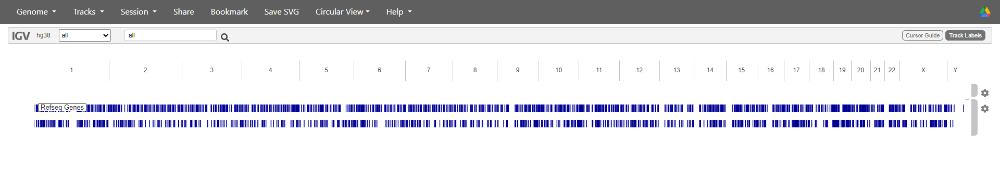

# Assess the alignment (visualisation)

It is often instructive to look at your data in a genome browser. Visualisation will allow you to get a "feel" for
the data, as well as detecting abnormalities and problems. Also, exploring the data in such a way may give you
ideas for further analyses.  As such, visualisation tools are useful for exploratory analysis. In this lesson we
will describe one particular tool for visualisation: the Broad Institute's Integrative Genomics Viewer (IGV) which requires
software installation and transfer of files.

In order for us to visualise the alignment files, we will need to index the BAM file and generate a **bam.bai** file.

When we indexed the reference genome we used `bwa` because we were working with a FASTA file. This time we are working with a BAM file so we'll use `samtools` instead, but the general principle is the same.

~~~
$ samtools index SRR2584866.aligned.sorted.bam
~~~
{: .bash}

## Viewing with IGV

[IGV](https://igv.org/) is an interactive tool for visually exploring genomic data. It can be used either as a desktop application or a web app. Today we'll be using the web app version.

There are other web-based genome browsers like [Ensembl](http://www.ensembl.org/index.html) or the [UCSC browser](https://genome.ucsc.edu/) which provide more functionality (such as annotations and external data sources) and may be worth exploring in your own time.

To use IGV we will need three sets of files:
- our *E. coli* genome (`ecoli_rel606.fasta`) and its index (`ecoli_rel606.fasta.fai`)
- our aligned and sorted reads (`SRR2584866.aligned.sorted.bam`) and their index (`SRR2584866.aligned.sorted.bam.bai`)
- our filtered list of SNPs (`SRR2584866_final_variants.vcf`)

We will need to transfer these files from our cloud instance to our local machine. We know how to do this with `scp`. 

> The command `scp` always goes in the terminal window that is connected to your local computer (not your AWS instance).
{: .callout}

Open a new tab in your terminal window and make sure you are in your existing `cloudspan` directory. Then, create a new folder called `files_for_igv`.

~~~
$ pwd
$ mkdir files_for_igv
~~~
{: .bash}

Now we will transfer our files to that new directory. Remember to replace `NNN` with your AWS instance number. 

~~~
$ scp -i login-key-instanceNNN.pem csuser@instanceNNN.cloud-span.aws.york.ac.uk:/home/csuser/cs_course/data/ecoli_rel606.fasta files_for_igv
$ scp -i login-key-instanceNNN.pem csuser@instanceNNN.cloud-span.aws.york.ac.uk:/home/csuser/cs_course/data/ecoli_rel606.fasta.fai files_for_igv
$ scp -i login-key-instanceNNN.pem csuser@instanceNNN.cloud-span.aws.york.ac.uk:/home/csuser/cs_course/results/SRR2584866.aligned.sorted.bam* ~/Desktop/cloudspan/files_for_igv
$ scp -i login-key-instanceNNN.pem csuser@instanceNNN.cloud-span.aws.york.ac.uk:/home/csuser/cs_course/results/SRR2584866_final_variants.vcf files_for_igv
~~~
{: .bash}

Next, we need to open the [IGV web app](https://igv.org/app/) in a web browser. It should look something like this when it loads:

### Loading the reference genome

We will start by loading our reference genome. Select **Genome > Local File** and use the file browser to select and upload **both** ecoli_rel606.fasta and ecoli_rel606.fasta.fai. *If you don't select both files at the same time IGV will show an error*.

It will look like nothing has happened except for the default data disappearing. Don't worry! The genome is just too zoomed out to represent visually. Zoom in and out using the controls at the top right of the page - if you zoom in far enough you will start to see coloured lines representing the different bases making up the genome.

### Loading the reads 
Next we load the aligned reads, which go on their own 'track'.

Select **Tracks > Local File** and select **both** SRR2584866.aligned.sorted.bam and SRR2584866.aligned.sorted.bam.bai. Again, you must upload both files at the same time.

You can play around with various settings on the track to change what is shown and how the reads are coloured. We will turn off all colouring to make it easier to read. Go the track's settings (the gear on the far right of it) and untick 'pair orientation & insert size (TLEN)'.  

If you are zoomed in enough you should now see a visual representation of all the reads in the sample, lined up underneath the reference. Each grey rectangle/arrow represents a single read. The bar chart above the reads indicates the level of coverage for each position in the genome - more reads overlapping with that position gives a higher coverage.

### Loading the SNPs
Finally we can load the file containing information about the SNPs we've identified. Select **Tracks > Local File** again and this time upload SRR2584866_final_variants.vcf.

The data will appear in a new track underneath the reference and aligned reads. Go the track's settings and untick 'Show Genotypes'.

## Inspecting the visualisation
Zoom right out of the visualisation. The reference genome and aligned reads will disappear.

Each of the dark blue lines on the VCF track represents a position where we have determined that a SNP or variant is present. This sample has lots! You can double click on a suspected SNP to zoom in on it - keep going until you can see the aligned reads.

You will see that in positions where a variant has been identified, these changes are also marked on the reads. There are also locations on the reads where a SNP has been identified on just one read out of several covering that position (see image below). In this case, our filtering deemed that SNP to be unreliable since it was only present on a single read.

Zoom in to inspect variants you see in your filtered VCF file to become more familiar with IGV. See how quality information
corresponds to alignment information at those loci.
Use [this website](http://software.broadinstitute.org/software/igv/AlignmentData) and the links therein to understand how IGV colors the alignments.

> ## Installing Software
>
> It's worth noting that all of the software we are using for
> this workshop has been pre-installed on our remote computer.
> This saves us a lot of time - installing software can be a
> time-consuming and frustrating task - however, this does mean that
> you won't be able to walk out the door and start doing these
> analyses on your own computer. You'll need to install
> the software first. Look at the [setup instructions](https://software.broadinstitute.org/software/igv/download) for more information
> on installing these software packages.
{: .callout}

## What next?
We've now come to the end of our variant calling workflow. We have a list of all the presumed SNPs in our sample, and we've visualised where they are in the genome. If this were a real analysis, however, our work would not yet be done.

### Analyse and compare other samples
First of all, we have more samples to analyse! For this example workflow we chose to look at sample SRR2584866. However, we downloaded two other samples - SRR2584863 and SRR2589044 - at the start of this session. 

Each sample represents a different timepoint in the *E. coli* long-term evolution experiment we discussed previously:
- SRR2589044 was sampled from generation 5000
- SRR2584863 was sampled from generation 15,000
- SRR2584866 was sampled from generation 50,000

> ## Challenge 1
>
> Look back at the [background information](https://cloud-span.github.io/02genomics/03-background/index.html) and the [metadata](https://github.com/Cloud-SPAN/04genomics/blob/gh-pages/files/Ecoli_metadata_composite.csv) for this dataset.
>
> What differences do you predict you would see between the SNP call outputs for the three samples? Think about the number of mutations present and how this might differ.
>
> > ## Solution
> >
> > We might predict that the number of mutations will increase as the generations go on, with SRR2584866 having most and SRR2589044 having least.
> >
> > Additionally, looking at the metadata table tells us that SRR2584866 (generation 50,000) is known to be both hypermutable and able to metabolise citrate (Cit+). This sample is therefore likely to have a lot more mutations than its predecessors, which are not hypermutable.
> {: .solution}
{: .challenge}

> ## Challenge 2
>
> Test your hypothesis! Go back through the variant calling workflow with the other two samples. You can start from ["Align reads to reference genome"](https://cloud-span.github.io/04genomics/01-variant_calling/index.html#:~:text=Align%20reads%20to%20reference%20genome) as the reference genome doesn't need indexing again.
>
> You may want to create some folders to organise the results for each individual sample.
>
> Once you have generated your VCF files you can view these in the IGV web app alongside your existing file. Add each VCF file as a new track. You might also want to upload the aligned reads (and their index) on separate tracks too. Once you have everything uploaded, use the viewer to examine the differences between the three samples. Was your prediction correct?
{: .challenge}

### Annotate your VCF file
The VCF file we have generated tells us **where** SNPs are located, but not a lot about **what** they affect. Are they affecting coding or non-coding DNA? Do they affect protein coding? How strong are these effects?

You can answer (some of) these questions using annotation software, such as [SNPEff](https://pcingola.github.io/SnpEff/snpeff/introduction/), [ANNOVAR](https://annovar.openbioinformatics.org/en/latest/) or [Ensembl's Variant Effect Predictor (VEP)](https://annovar.openbioinformatics.org/en/latest/).
These programs work by comparing the variants in the VCF file with a fully annotated copy of the relevant genome (often available publicly online), which contains information about where genes and regulatory regions are located, what they do, what the proteins they code for look like and so on. Variants can be classified according to what kind of effect they have and how strong this effect is.

 Some programs, like SNPEff, even output an HTML report summarising the findings:
 

 In this report (which is for a different organism, but is still useful as an example) we can see that effects have been classified by:
 - type (whether they are a SNP, a MNP, insertion, deletion etc)
 - impact (how strong an effect they are likely to have on the resulting protein e.g. a variant which introduces a premature stop codon is likely to cause loss of function and therefore has a high impact)
 - functional class (whether SNPs introduce a change in amino acid sequence or not)
 - type and region (more detailed information about where variants are occurring e.g. upstream of a gene, in a gene-coding region, downstream etc)

 These annotation software programs are very useful tools to get more information out of your VCF file.

 ### Focus on a specific gene or region
 You might be interested in just a specific gene or region. You can filter your VCF file to just show SNPs which fall within a particular region, then look more closely at these SNPs.

 ### Population structure analysis
By comparing the VCF outputs from multiple samples you can identify population structure (i.e. how the various samples are related). This is useful if you are interested in the evolutionary history of your species of interest.

A good tool for this is [Plink](https://www.cog-genomics.org/plink/). Using Plink you can do principal components analysis (PCA), a way to visualise differences between samples in a two-dimensional plot. A PCA plot can reveal clusters of samples that are more genetically similar to each other than to others. This in turn tells you which samples are closely related and which have diverged from one another over time.

 ### Population genomic diversity
The diversity of samples can be expressed in a few different ways, all of which can be calculated using [vcftools](https://vcftools.sourceforge.net/man_latest.html). Here are a few:
- nucleotide diversity (π) is a simple measure of genetic diversity which can give an idea of how SNPs are spread out across the genome - are they more concentrated in particular regions? Are there regions with very low diversity (indicating a possible conserved region)?
- Tajima's D can determine whether a region of DNA is under selective pressure by comparing how the frequency of "neutral" SNPs fluctuates
- the fixation index (fst) is a measure of population separation (or genetic distance) between two populations - this can either apply to the genomes overall or can be compared across regions of the genome